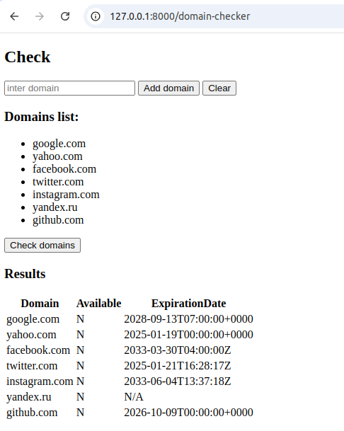

#TASK

Написать программу, которая принимает домен или список доменов и подтягивает через сторонний апи данные:
- доступен или нет
- если нет, дата окончания

Проверка каждого домена должна идти асинхронно

Использовать:
Laravel
Livewire или Vue3

#RESULT

